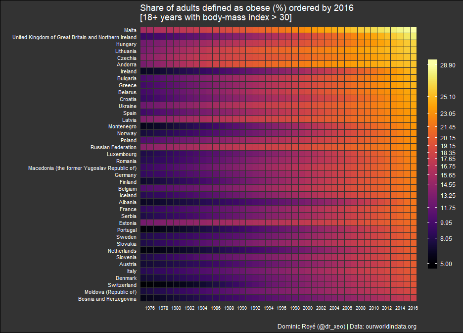

Adult obesity in the World
================
Dominic Royé
02/09/2018

Time serie as heatmap
---------------------

R Code for the heatmap published at [Twitter](https://twitter.com/dr_xeo/status/1034016258616950784)

Author: Dominic Royé (@dr\_xeo) | <https://dominicroye.github.io/en/>


``` r
### libraries ###
library(tidyverse)
library(readxl)
library(viridis)
library(classInt)

## import data ##

data <- read_csv("share-of-adults-defined-as-obese.csv")

## data preparation ##
#change col names
names(data)[3:4] <- c("year","obesity")

#import codes for regions
cod <- read_csv("https://raw.githubusercontent.com/lukes/ISO-3166-Countries-with-Regional-Codes/master/all/all.csv")

#join regions and obesity data
df <- left_join(data,cod,by=c("Code"="alpha-3"))

#filter Europe
df_europe <- df %>% filter(region=="Europe") %>% mutate(date=str_c(str_replace(year,"ID",""),"01","01",sep="-")%>%as.Date())

#countries order by 2016
ord_2016 <- filter(df_europe,year==2016)%>%
              arrange(desc(obesity))%>%
                pull(name)

#breaks for color scale
br <- classIntervals(df_europe$obesity,15,"kmeans")$brks

## plotting ##
#custom theme definitions
theme_heatmap <- theme_minimal()+
                   theme(panel.grid=element_blank(),
                        axis.text.y = element_text(color="white", size=rel(.9)),
                        axis.text.x = element_text(color="white", size=rel(.8)),
                        strip.switch.pad.grid=unit(-0.5,"lines"),
                        strip.text = element_blank(),
                        plot.background = element_rect(fill="gray20"),
                        panel.background = element_rect(fill="gray20"),
                        legend.title=element_blank(),
                        plot.caption=element_text(colour="white"),
                        plot.title = element_text(colour="white"),
                        legend.text = element_text(colour="white", margin=margin(l = 5)),
                        panel.border = element_rect(fill=NA,color="gray20", size=0.5,
                                                    linetype="solid"))

#plot
df_europe %>% mutate(name=factor(name,rev(ord_2016)))%>%
    ggplot(aes(date,name,fill=obesity))+
        geom_tile(colour="grey20")+
          scale_fill_viridis(option="B",na.value="grey20",breaks=br)+
          scale_x_date("",date_breaks = "2 year",date_labels = "%Y",expand=c(0,0))+
            labs(y="",caption="Dominic Royé (@dr_xeo) | Data: ourworldindata.org",
             title="Share of adults defined as obese (%) ordered by 2016\n[18+ years with body-mass index > 30]")+
            guides(fill=guide_colorbar(barheight=22,barwidth = 1))+
        theme_heatmap
```



Data source
-----------

The dataset can be downloaded at [ourworldindata.org](https://ourworldindata.org/obesity).
